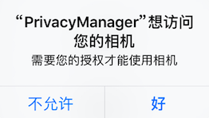
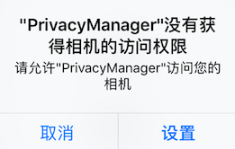

# RxPrivacyManager

Privacy manager for iOS based on RxSwift

Currently supported:

- [x] Camera
- [x] Photos
- [x] Location Services
- [x] Microphone
- [x] Contacts
- [x] Speech

Each has a framework that you can add separately to your project.

## Usage

Before, to take photo like this.

```swift
func buttonTapped() {
  let status = AVCaptureDevice.authorizationStatus(for: .video)
  switch status {
  case .notDetermined:
   AVCaptureDevice.requestAccess(
     for: AVMediaType.video,
     completionHandler: { granted in
       if granted {
         onMainThread {
           takePhoto()
         }
       } else {
         presentAlertController()
       }
     })
  case .authorized:
    takePhoto()
  default:
    presentAlertController()
  }
}

/// To open camera permission
func presentAlertController() {
  let alert = UIAlertController(title: title, message: message, preferredStyle: .alert)
  let cancelAction = UIAlertAction(title: "Cancel", style: .cancel) { _ in
    // ...
  }
  let settingAction = UIAlertAction(title: "Setting", style: .default) { _ in
    if let settingsUrl = URL(string: UIApplication.openSettingsURLString) {
      UIApplication.shared.openURL(settingsUrl)
    }
  }
  alert.addAction(cancelAction)
  alert.addAction(settingAction)
  alert.preferredAction = settingAction
  present(alert, animated: true, completion: nil)
}
```

Now, just a function. **It's so easy!!!**  

```swift
import PrivacyManager
import PrivacyPhoto

// In UIViewController and subclasses
PrivacyManager.shared.privacyCameraPermission(presenting: self, authorized: {
  takePhoto()
})
```

## Screenshot

##### For the first time



##### Without authorization




## Installation

### Carthage

```swift
github "cp3hnu/PrivacyManager"
```

-   Drag and drop *PrivacyManager.framework*, *PrivacyPhoto.framework* or other related framework from /Carthage/Build/iOS/ to *Linked Frameworks and Libraries* in Xcode (Project>Target>General>Linked Frameworks and Libraries)
-   Add new run script

```ruby
/usr/local/bin/carthage copy-frameworks
```

-   Add Input files

```sh
$(SRCROOT)/Carthage/Build/iOS/PrivacyManager.framework
$(SRCROOT)/Carthage/Build/iOS/PrivacyPhoto.framework
...
other related framework
```

### Swift Package

File -> Swift Packages -> Add Package Dependency,  then search rxprivacymanager.

## Dependencies

*   [RxSwift 5.0.0+](https://github.com/ReactiveX/RxSwift)

## Requirements

-   Swift 5.0
-   Xcode 10.0
-   iOS 9+ or iOS 10+（with Speech ）

## License

Released under the MIT license. See LICENSE for details.
